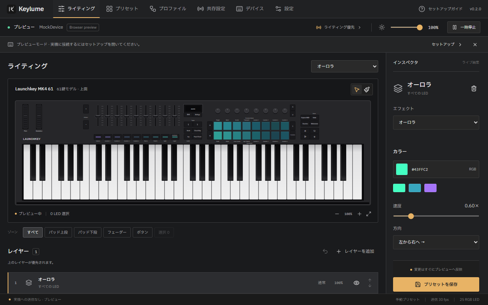

# Keylume

Launchkey MK4 61 向けの非公式 RGB ライティングコントローラー。Tauri 2 + Rust + React で、ウィンドウを閉じてもライティングを続けます。

**v0.2 は実機検証前のプレビュー版です。** 初期状態は MockDevice。実機の動作、DAW ごとの共存、スリープ復帰、72 時間連続稼働は、同梱の受け入れチェックリストで確認してください。Novation / Focusrite とは関係ありません。

## 起動

[GitHub Releases — v0.2.0 Preview](https://github.com/lingmulongtai/Keylume/releases/tag/v0.2.0) からダウンロードできます。

- [Windows インストーラー](https://github.com/lingmulongtai/Keylume/releases/download/v0.2.0/Keylume_0.2.0_x64-setup.exe)
- [ポータブル ZIP](https://github.com/lingmulongtai/Keylume/releases/download/v0.2.0/Keylume_0.2.0_windows-x64.zip)



インストーラーはダウンロードした `Keylume_0.2.0_x64-setup.exe` を実行してください。ポータブル版は `Keylume_0.2.0_windows-x64.zip` を展開して直下の `Keylume.exe` を実行します。WebView2 Runtime が必要です。インストーラーは未導入時に Runtime の導入を案内します。コード署名はしていません。

1. 起動してデバイスプレビューを確認します。
2. 「デバイス」で **MockDevice でプレビュー** を OFF にすると、Launchkey MK4 61 の DAW ポートを探します。
3. 「共存設定」で、ライティング優先または DAW に譲るを選択します。
4. LED マップ検証で、RGB ID、単色ボタンの種類、B3 / 93 の違いを確認します。
5. × はトレイへ格納。終了はトレイの「終了」を使います。

鍵盤とノブには LED がありません。キャンバスの鍵盤ハイライトは画面上だけの表示です。

## 実装した機能

- 公式の61鍵モデルに合わせた本体図。16 パッド、9 フェーダーボタン、17 単色候補、61 鍵、8エンコーダーを描画。選択、範囲選択、ペイント、200%までの拡大。
- 装飾を抑えた編集UI、上部ナビゲーション、エディターとプリセット一覧の共通本体図。
- 起動時と12時間ごとの更新確認、手動確認、新バージョンの案内。Preview版の通知と自動確認を設定可能。
- 18 エフェクト、5 ブレンド、ゾーン、不透明度、輝度・彩度・色温度・ガンマ、0.5 秒の切替。
- 13 プリセット定義、複製・保存・削除・検索、`.keylume.json` 入出力、schema 0 → 1 移行。
- Rust の常駐描画、差分送信、LED アドレスごとの最新値を保つ送信スレッド、トレイ、単一インスタンス、自動起動。
- DAW プロセス監視、ハンドオフ、入力転送、ノート / CC / チャンネルの変換、ポート再接続、転送停止時のノート解放。
- 前面アプリ / プロセス / 時間帯 / アイドルのプロファイル、手動固定、夜間・ロック時の減光。
- WASAPI ループバック、FFT 2048、8 バンド、平滑化・自動ゲイン。音声機能を使う間だけ取得。
- OLED の ASCII テキスト、時計、1bit 画像、スペクトラム。画像は ACK 待ち・最大 10 fps・タイムアウト停止。
- LED 検証、レイアウト編集・書き出し、MIDI モニタ、設定バックアップ、初回セットアップ案内。

現在の対応範囲と未実装項目は [実装状況](docs/implementation-status.md) を参照してください。「本体デモ」は非揮発設定の未検証値を含むため、自動プリセット切替から実行せずデバイス画面の明示操作に限定しています。

## 更新

**v0.1.0からはv0.2.0を一度手動でインストールしてください。** 以後は新しいWindows版を検出すると、アプリ内またはトレイ常駐時に案内します。「更新ページを開く」からダウンロードしてインストールできます。自動確認は設定でオフにできます。[更新確認の詳細](docs/updates.md)

プリセットと設定はそのまま保持します。旧既定レイアウトは61鍵モデルの配置へ移行し、LEDアドレス・種類・検証状態を保持します。座標を編集したカスタムレイアウトは維持します。[本体図と移行仕様](docs/device-layout.md)

## DAW と同時に使う

ライティング優先では、DAW の Launchkey ネイティブ制御サーフェスを解除します。鍵盤の MIDI 入力を有効にし、パッドとコントロールはユーザー作成のループバックで転送します。

通常の Windows MIDI Services のループバックは **A 出力 → B 入力** の対です。Keylume で A 側を、DAW で B 側を選んでください。Windows の `midir` は仮想ポートを作成しないため、自動作成は行いません。サービス稼働だけで WinMM のマルチクライアント対応を保証できません。

- [Microsoft: 導入方法](https://microsoft.github.io/MIDI/get-latest/)
- [Microsoft: 仮想ループバック](https://microsoft.github.io/MIDI/kb/virtual-loopback/)
- [Microsoft: 既存 MIDI API との互換性](https://microsoft.github.io/MIDI/kb/api-back-compat/)
- [Novation: Programmer's Reference v3](https://fael-downloads-prod.focusrite.com/customer/prod/downloads/launchkey_mk4_programmer_s_reference_guide-pdf-en_0.pdf)

## 開発

Windows 11、Node.js 22.12 以降、Rust 1.95（検証環境）、MSVC C++ Build Tools、WebView2 Runtime が必要です。

```powershell
npm ci
npm run desktop      # Rust コア + WebView
npm run dev          # ブラウザーで UI プレビューのみ
npm run package      # Windows NSIS インストーラー
```

ブラウザー版は実機 MIDI、OS プロセス監視、音声ループバック、自動起動を行いません。保存先も native 版とは独立した localStorage です。実機と同じフレームを表示するのはデスクトップ版です。

## 検証

実行済みのチェック、結果、コードのコミット一覧は [検証記録](docs/verification.md) にまとめています。

GitHub Actions は PR と `main` で Windows のテスト・インストーラー生成・ネイティブ自己テストを実行します。`main` に含まれる `v*` タグから同じ検証を行い、成功した成果物だけを Preview Release に公開します。Release には SHA-256、ビルド元コミット、Mock 検証結果を添付します。

```powershell
npm test
npx playwright test  # Microsoft Edge を使用
npm run build
cargo test --manifest-path src-tauri/Cargo.toml
cargo clippy --manifest-path src-tauri/Cargo.toml --all-targets -- -D warnings
cargo fmt --manifest-path src-tauri/Cargo.toml --check
```

ネイティブの常駐処理を実機なしで確認する自己テスト:

```powershell
.\artifacts\Keylume.exe --tray --self-test C:\Temp\keylume-smoke.json
```

自己テストは指定した JSON と隣接する `.data` フォルダに結果を保存し、接続、停止・再開、DAW 譲渡、DAW 終了、切断・再接続、保存を MockDevice で確認して終了します。既に起動中の Keylume を終了してから実行してください。

## 保存場所と構成

通常の設定: `%APPDATA%\Keylume\`。`settings.json`、`presets/`、`profiles/`、`layouts/layout.json`、`logs/` を使用します。正常な前回値は `.json.bak` に保持します。破損ファイルは `.corrupt-*` に隔離します。

- `src-tauri/src/engine.rs`: レンダリングとエフェクト
- `src-tauri/src/device/`: プロトコル、Mock / hardware、非同期送信
- `src-tauri/src/desktop/`: 常駐、IPC、プロセス、音声、トレイ、電源通知
- `src-tauri/src/{routing,profiles,storage,model}.rs`: 入力変換、選択、永続化、検証
- `src/`: React エディター、ブラウザープレビュー
- `resources/`: 共通レイアウト、プリセット、近似パレット
- `docs/`: 受け入れ手順、実装状況

パレットのプレビューは近似値です。実測パレットや検証済み機器アドレスとして扱わないでください。外部 SDK のソースコードはコピーしていません。フォントのライセンスは [THIRD_PARTY_NOTICES.md](THIRD_PARTY_NOTICES.md) に記載しています。
